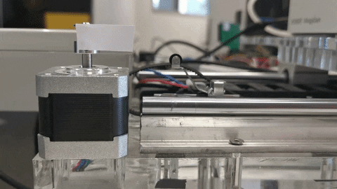

# Tic Stepper Motor Python Controller
## Overview
The repository contains a tic stepper motor python controller class. It has been implemented to use [**ticcmd** ](https://www.pololu.com/docs/0J71/8) commands to control a stepper motor in an easy and convenient way using a python class. 

## Requirements
- install [tic](https://www.pololu.com/docs/0J71/3.2) software

## Preparatory Steps
1. Clone repository
2. copy the StepperMotor.py to the folder where you intend to create the stepper motor control software

## Program description
1. The **```StepperMotor.py```** contains the implementated class of the controller which allows to control the stepper motor. The class contains the most frequently used commands for controlling a stepper motor. It also allows you to change various parameters such as maximum speed and acceleration.

2. The **```ExampleUsage.py```** contains an example  usage of the class  that shows all the implemented functions.

## Class methods:

### General commands:
- ``get_status()`` - Show device settings and info

### Control commands:
- ``set_desired_position(desired_position)`` - Set targed position in microsteps
- ``get_current_position()`` - Return current position of the motor 
- ``home_sequence(dir)`` - Drive to limit swith; dir could be "right" or "left"
- ``reset()`` - Make the controller forget its current state
- ``deenergize()`` - Disable the motor driver 
- ``energize()`` - Stop disabling the motor driver 

### Temporary settings
- ``set_max_speed(max_speed)`` - Set the speed limit
- ``set_starting_speed(starting_speed)`` - Set the starting speed 
- ``set_max_acceleration(max_acceleration)`` - Set the acceleration limit
- ``set_max_deceleration(max_decelaration)`` - Set the deceleration limit
- ``set_current_limit(current_limit)`` - Set the current limit in mA

## Example usage:
The simplest possible use of the **StepperMotor** class to move the motor to a given position (in this example 500) looks as follows:
```python
from StepperMotor import stepper_motor
import time

motor = stepper_motor()
time.sleep(1)

desired_position = 500
motor.set_desired_position(desired_position)
time.sleep(3)
```


If you need to convert position values into revolutions or centimeters (or any other unit you need) in the case of linear gears, you can use the mapping_value variable and set a specific scaling factor in the constructor by
```
motor = stepper_motor(mapping_value=scalingfactor)
```

To test the functionality of the Stepper class, run the program **```ExampleUsage.py``**. 
To see what arguments you can pass call:
```
python3 ExampleUsage.py -h 
```
you should see the following description:
```
usage: ExampleUsage.py [-h] [-mv MAPPING_VALUE] [-ss STARTING_SPEED]
                       [-cl CURRENT_LIMIT] [-ms MAX_SPEED]
                       [-ma MAX_ACCELERATION] [-md MAX_DECELERATION]

optional arguments:
  -h, --help            show this help message and exit
  -mv MAPPING_VALUE, --mapping_value MAPPING_VALUE
                        new mapping value
  -ss STARTING_SPEED, --starting_speed STARTING_SPEED
                        new starting speed value
  -cl CURRENT_LIMIT, --current_limit CURRENT_LIMIT
                        new current limit value
  -ms MAX_SPEED, --max_speed MAX_SPEED
                        new max speed value
  -ma MAX_ACCELERATION, --max_acceleration MAX_ACCELERATION
                        new max acceleration value
  -md MAX_DECELERATION, --max_deceleration MAX_DECELERATION
                        new max deceleration value

```
Then you can just run the script without arguments, or if you want to change the default value of temporary parameters, pass the arguments as following:
```
python3 ExampleUsage.py -mv 6.25 -ss 500 -cl 800 -ms 700000 -ma 90000 -md 90000
```
You should see: 
```
INFO:root: Current position 0
INFO:root: Desired position 0
INFO:root: Mapping value: 6.25
INFO:root: Max speed: 6000000
INFO:root: Starting speed: 0
INFO:root: Max deceleration: 80000
INFO:root: Max acceleration: 80000
INFO:root: Current limit: 400 mA 


INFO:root: Starting speed after changes: 500
INFO:root: Current limit after changes 800 mA
INFO:root: Max speed after changes: 700000
INFO:root: Max acceleration after changes: 90000
INFO:root: Max deceleration after changes: 90000
INFO:root:

command could be: 
    Float desired position, or 
    home - to make home sequence, or 
    d - to degenerize the motor, or 
    e - to energize the engine, or 
    r - to reset the controller 
    status -  to print the status 
    position -  to print the current position of the motor 

New command: 
```
Then you can pass new command like new desired position to test **StepperMotor** class. As you can see the class does not contains all posibility of the [**ticcmd** ](https://www.pololu.com/docs/0J71/8) commands. So feel free to modify the class and add functionalities you need.


